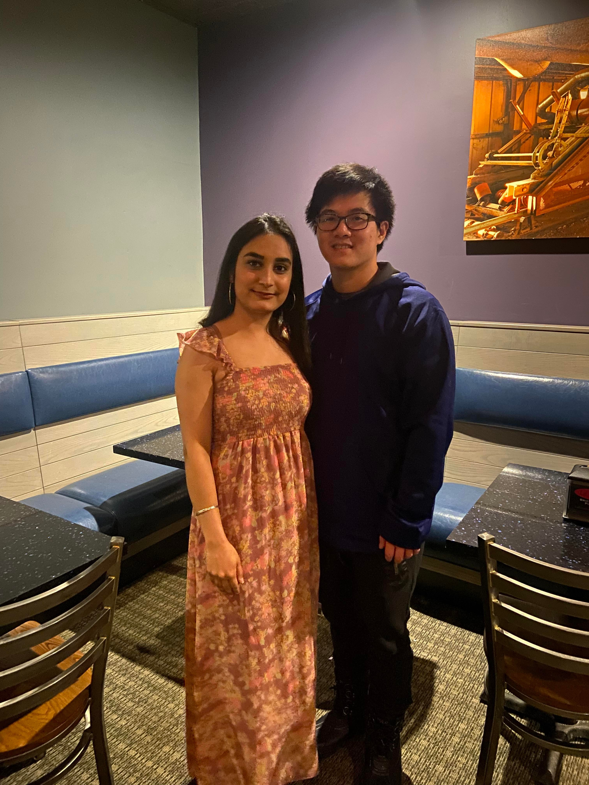
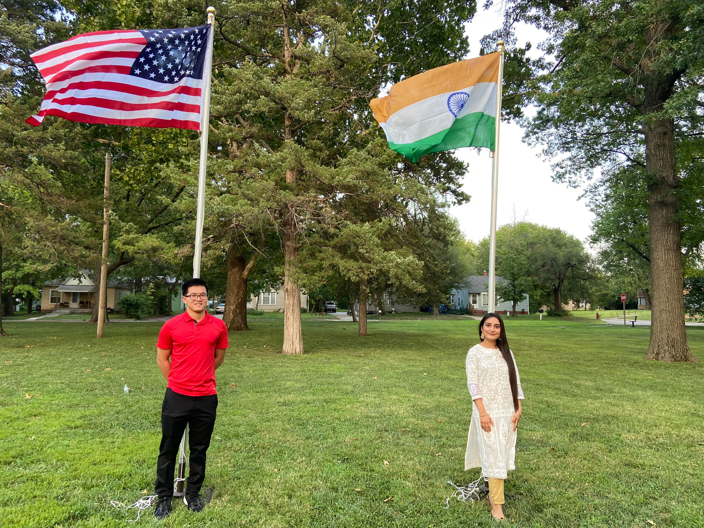
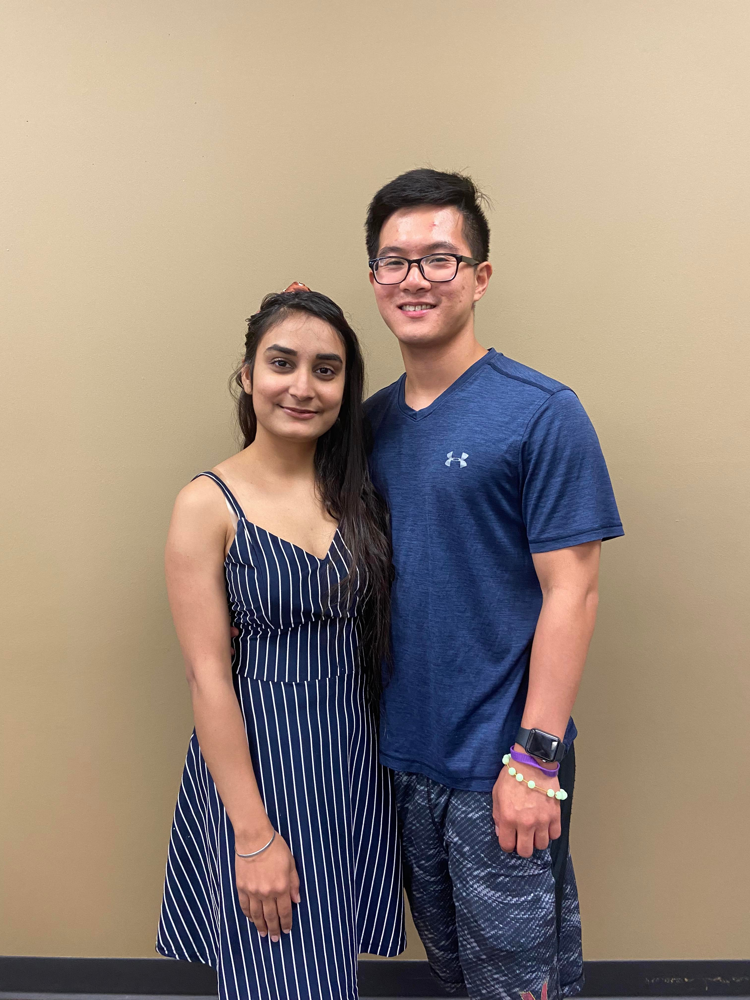

# What is or isn’t love 

```{r eval=FALSE}

Love isn’t a beautiful spring in an enchanted forest
Deep in the soft misty dew
Songs from the birds and quaking trees

Love is the ache you feel when she doesn’t pick up the phone
The emptiness you feel waking up
The pain from the distance and time zones

Love isn’t being comfortable at all times
Having the answers to all of your problems
Giving reasons to stay together forever

Love is sharing our scars
Counting the days till we see each other
Waking up late and starting the day beyond normal

Love isn’t rational like science or math
It is responsible for being irresponsible 
It is being familiar with fullness and belonging

Even when my hair is overgrown and my clothes are oversized
When my English isn't English 
When my body isn't as fit

You accept me

```

<center>


{length=300px, width=150px}

{length=300px, width=150px} 

{length=300px, width=150px} 


</center>