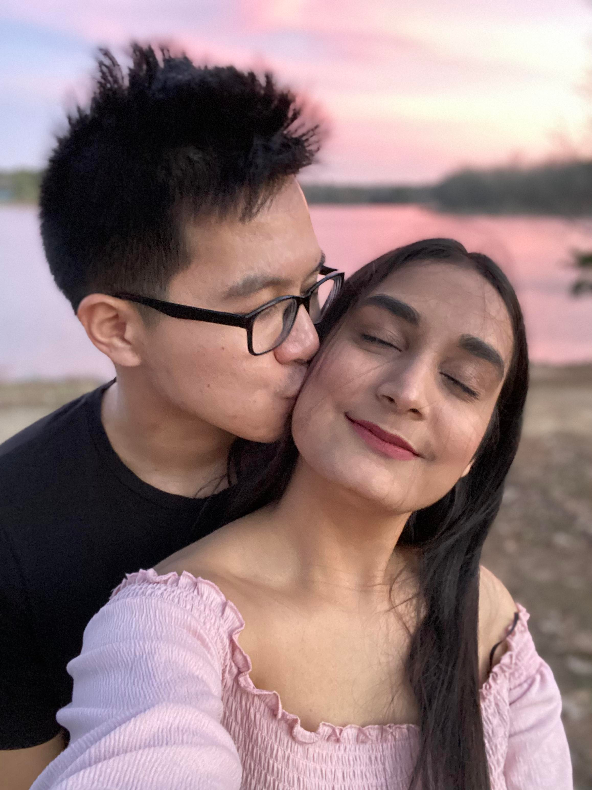
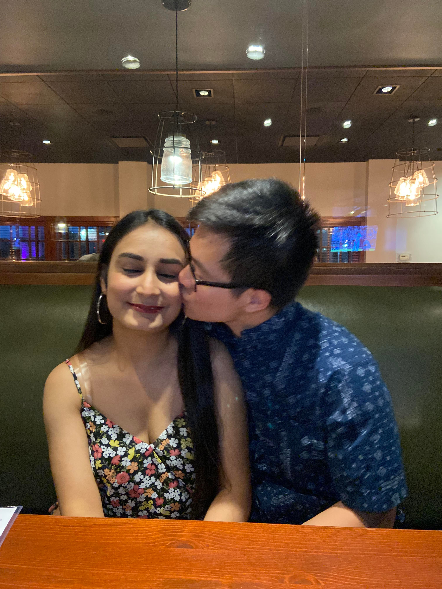
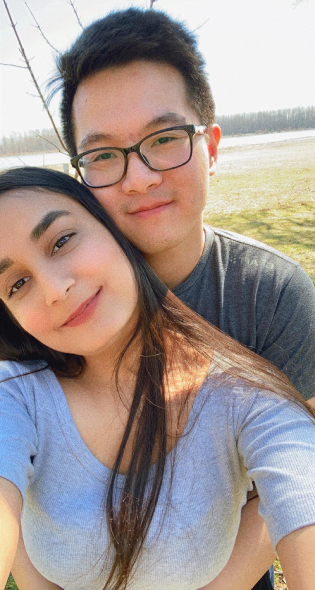
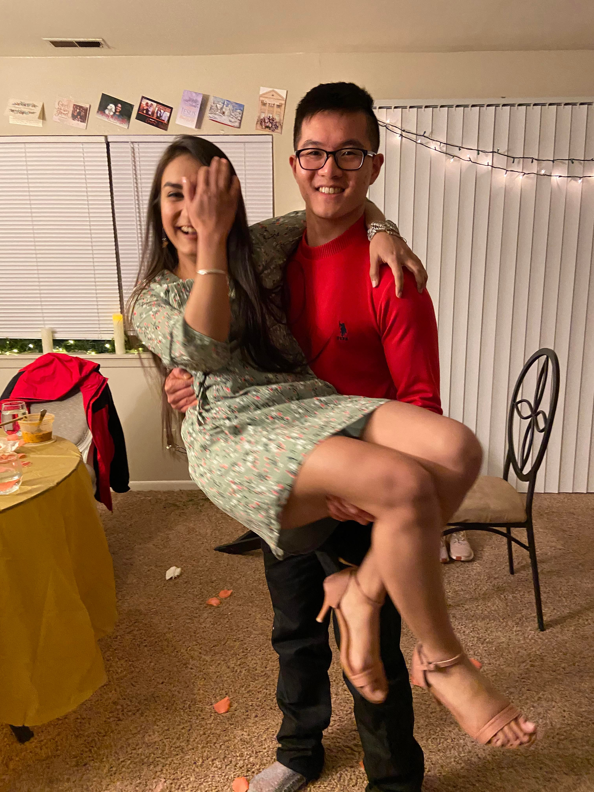
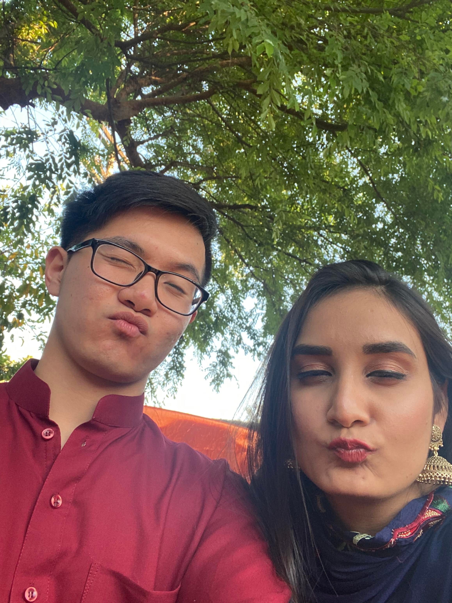

# Sleepless Nights Home Alone

```{r eval=FALSE}
I am older now.
Trained by parents.
But still protected by fear.

I sleep lightly,
Scared of something,
Stirred to uncertainty.

No laws against silence,
Every sound a nail,
to the boards of emptiness.

A frenzied attack.
I merely lie still,
With no means of defense.

How my skin crawls, itches, and senses,
The assault begins,
As I start my sleep.

Why do I let my mind,
Premature in sleep.
Get under my skin.

How I wish to take shelter in you.
to hold you, to kiss you,
and stay by you forever.
```

<center>

{length=1000px, width=500px}

{length=1000px, width=500px}

{length=1000px, width=500px}

{length=1000px, width=500px}
{length=1000px, width=500px}


</center>