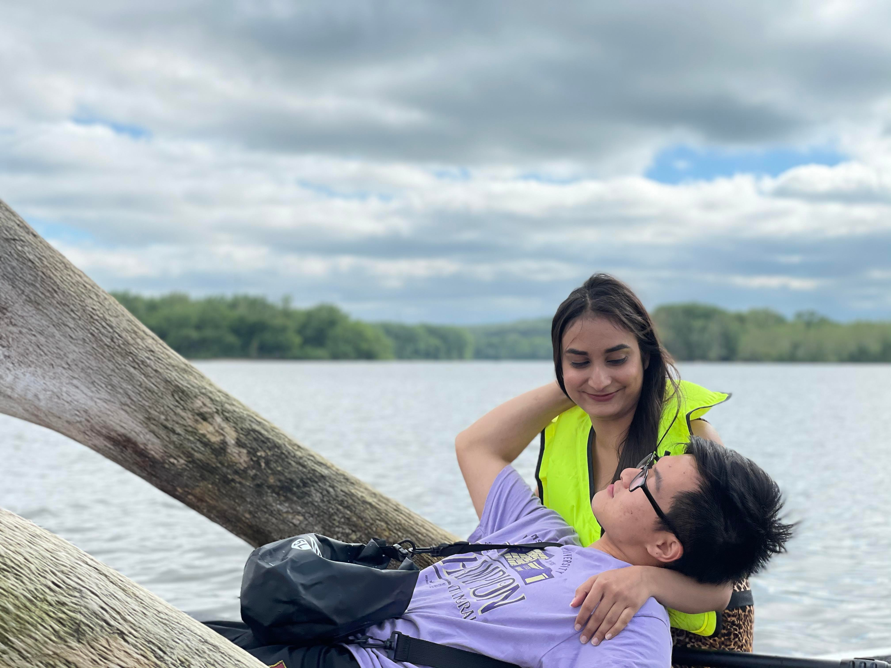

# To be where you are


```r
I would like to be there,
There where ever you are.
Pray the weight of the distance is less,
Than the weight of luck.
The luck of providence to bring us together.

The old times,
They don't measure up to the new.
But the new times,
They don't feel like the old.
It's just how we grow.

Like that time,
we went kayaking,
and within a year 
we came together 
and off we went paddling.

```

<center>


{length=1000px, width=500px}


{length=1000px, width=500px}

</center>


