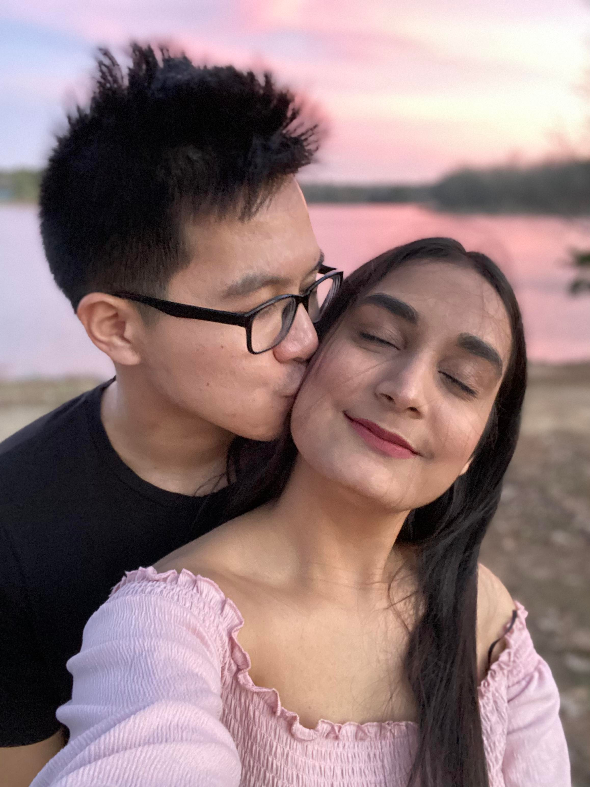
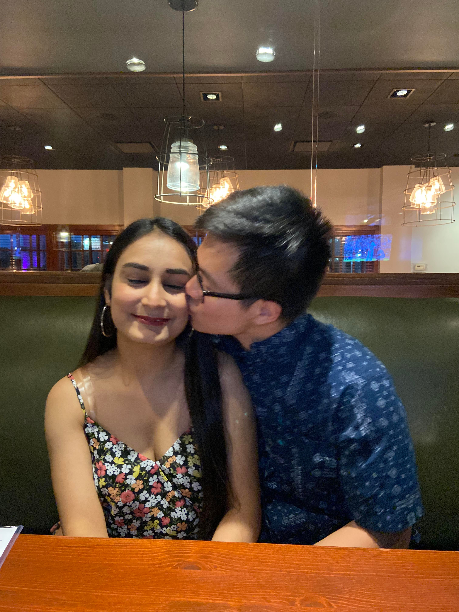
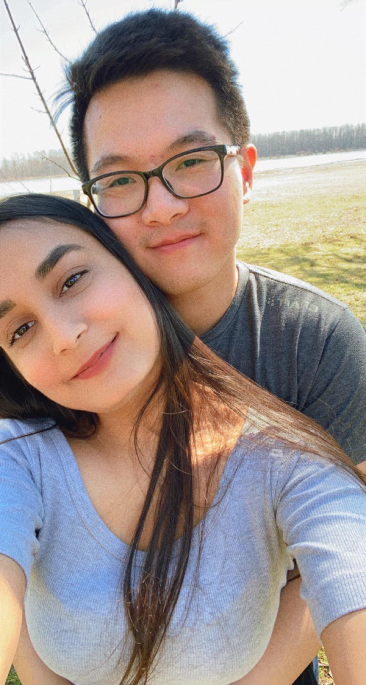
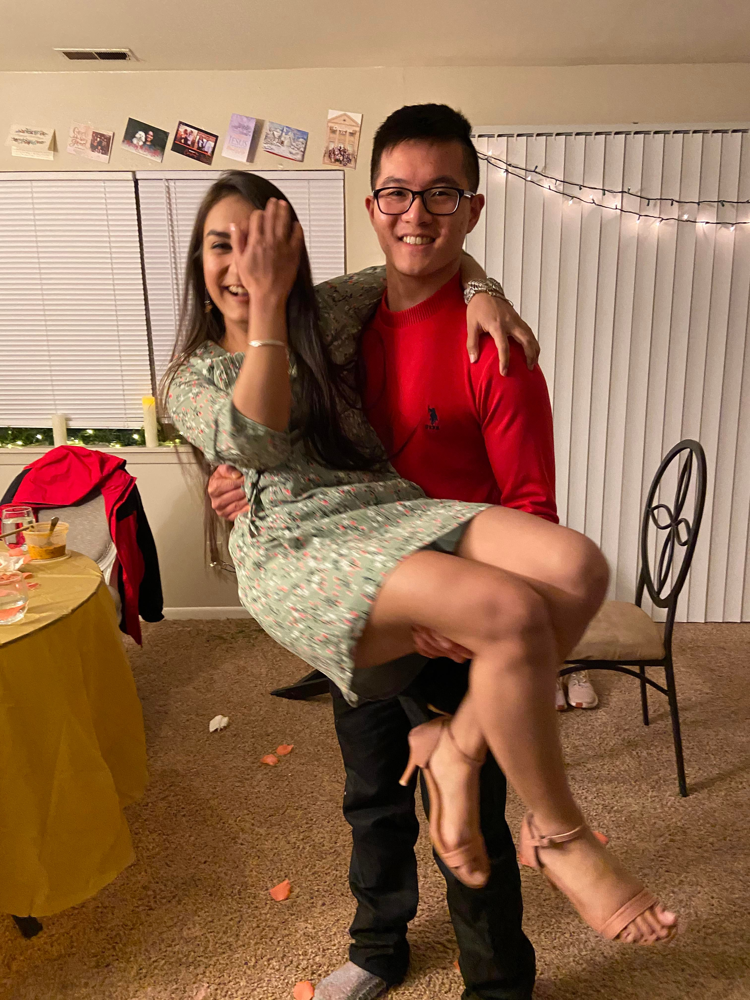

# Sleepless Nights House Alone


```r
I am older now
Trained by parents
Protected by fear

I sleep lightly
Scared of something
Stirred to uncertainty

No laws against silence
Every sound a nail
In a feeling of loss 

A frenzied attack.
I merely lie still
With no means of defense

How my skin crawls, itches, and senses
The assault begins
As I start my sleep

Why do I let my mind
Premature in sleep
Get under my skin

How I wish to hold you 
and kiss you
but I tell myself I shouldn't
```

<center>

{length=400px, width=200px}

{length=400px, width=200px}

{length=400px, width=150px}

{length=400px, width=150px}

</center>
