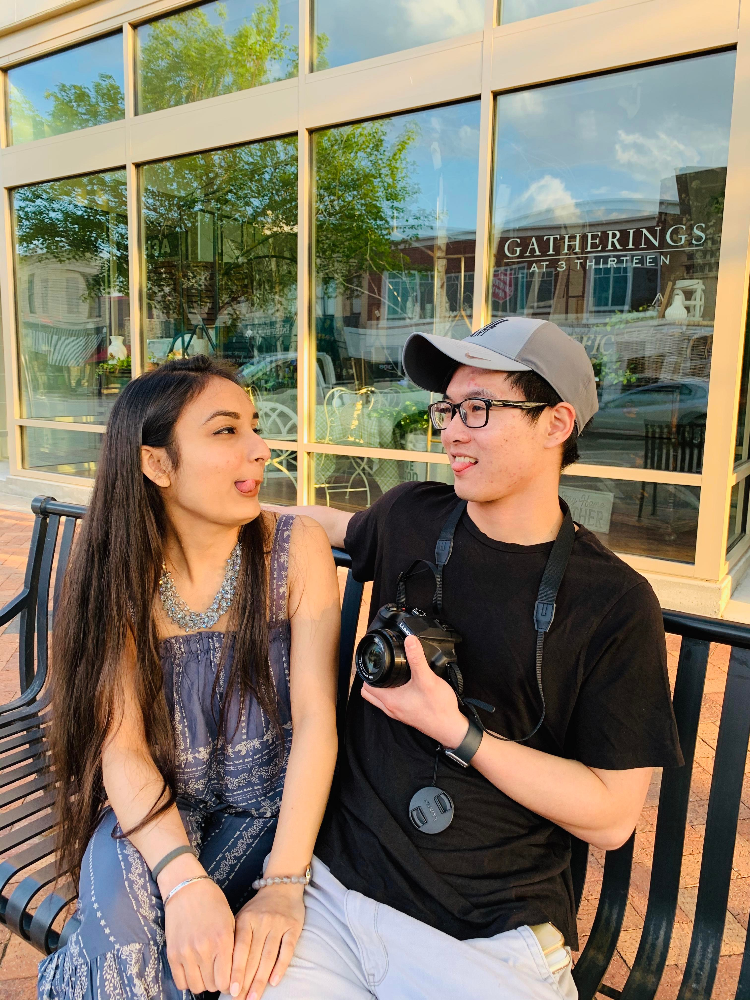
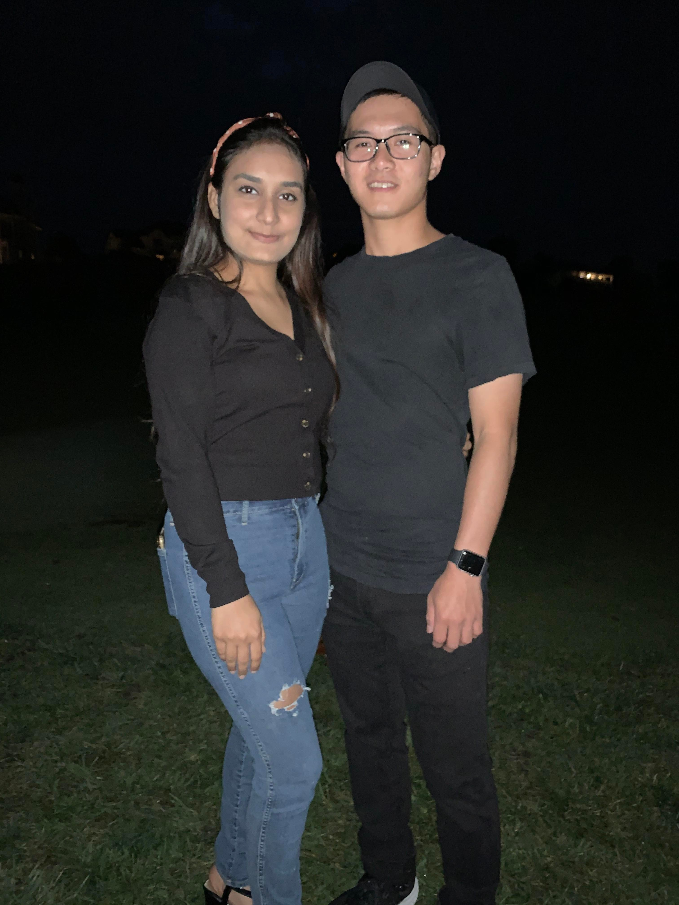
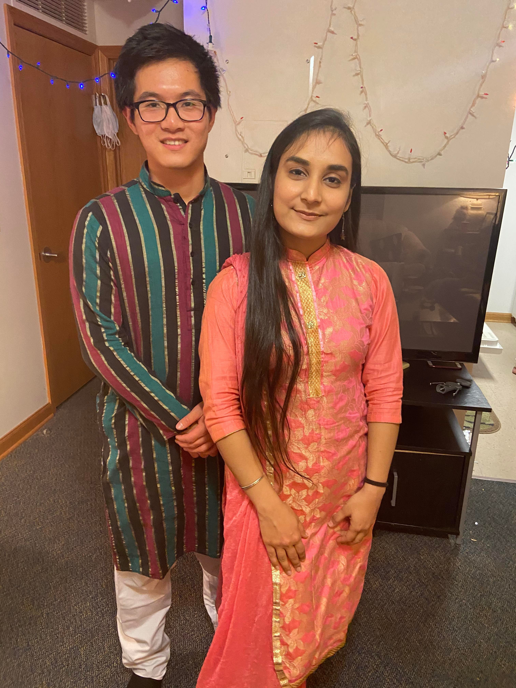

# Journey 


```r
My hands on my fat thighs.
Believing I would end up lost.
My body signals,
Enough of this cruelty 

How I walk slowly back home,
Close to falling,
Sinking lower at each stride,
Rising high with each low.

Thousands of fools,
Obsessed in their self-destruction,
But that’s how the journey is,
The journey of love

To bear the distant longing,
To bear sleepiness from endless talking,
To bear two different worlds,
Hoping on converging.

How I hold space in my life,
For a vision of you,
Who will come by,
To lift me higher.

To feel a bond,
That feeling is 
What I starve for
Beyond all.

```


<center>


{length=400px, width=100px}

{length=400px, width=100px}

{length=400px, width=100px}

</center>
